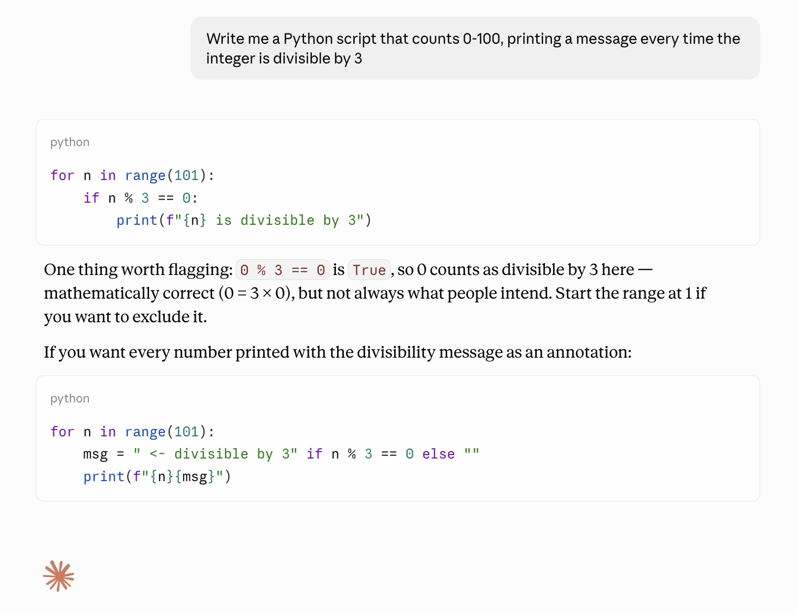
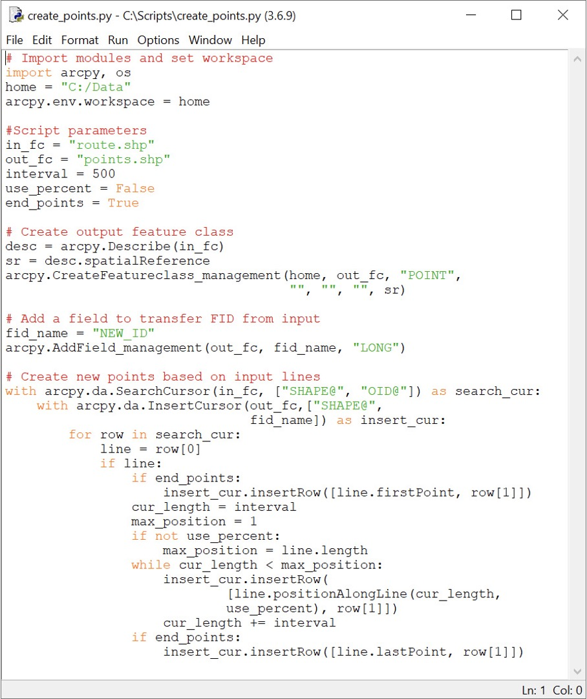

# Spatial Programming

### GEOG 49076 / 59076 / 79076

<div class="spacer-lg"></div>

## Week 01.01: Course intro

### Dr. Patrick Bitterman


---

# Today's schedule

- Course welcome
- Introductions
- Syllabus and course basics
- Setup
- For next class

---

## But first, anything to discuss?

---

## (some of) What this course is, as an example:

- You need a 1-mile buffer around every state park in Ohio. That's... sixty-seven parks.

- **Making one map is fine:** open the tool, fill in the dialog, click run, done

- **But making five hundred maps?** one per county, one per year, one per client — clicking through that same dialog five hundred times is less fine. Slow, error-prone, soul-crushing(!)

- Programming is how we transition from "I did this once" to "I can do this reliably, on any input, as many times as I need to"

---

## Benefits of a programmatic approach

- **Repeatable:** Run it again next year on new data. Same steps, same result
- **Shareable:** Hand it to a colleague. They don't need to guess which dialog boxes you clicked (and you don't have to write down all of your steps)
- **Checkable:** Code can be read, reviewed, and tested. A sequence of clicks can't

*This course is about building reproducible, auditable workflows. Not just about programming for its own sake*

---


# My approach to this course

- Geography matters
- Concepts and independent thinking are important, trivia is not (or at least not always)
- It's important to solve problems or complete tasks, but understanding *HOW* you do is more important
- I do NOT expect you to magically become a spatial Python expert at the end of term
- Focus is on programmatic *thinking*

---

# What this class is

- Collaborative
- Flexible
- Hands-on
- Student-led
  - I am not going to recap the readings (much)
  - You are expected to be ready to participate in discussion
  - We will spend most of our time doing, not lecturing

---

### What else it is

- A bit mis-named
- Previously part of the online MGIS program at KSU, but not really anymore
- My first time teaching it at KSU (but not my first time overall)... so we'll experiment a bit

---


# Class introductions

- Pair up - don't leave anyone behind, then SHARE:
  - Name
  - Where you're from
  - Major/program, year
  - Why you're taking the course?
  - Something fun, interesting, meaningful from the summer
  - Previous GIS experience
  - Previous programming experience
  - Imagine it's December 2026 - what would make you feel like you were successful in this course? *(save this one somewhere)*

---

# My introduction

- Dr. Patrick Bitterman
- Independence, IA -> UIowa -> UVM -> UNL -> KSU
- Assistant Professor in Geography Department, 3nd/8th year
- Goals: teach a successful course, build my research program
- GIS experience? Programming experience? Extensive, but I don’t use ArcGIS much…

---

# Success in this course

- students reach *their* learning objectives
- students are able to use Python to make their work faster and more consistent
- students improve methods related to their other research or career interests
- students develop an appreciation for programmatic spatial analysis

---

# Share

- Present your partner to the class

- Who wants to go first?

---

# Questions?

---

# Course basics

---

# Instructor (me)

- Dr. Patrick Bitterman
- Geography Department

- Office: 436 McGilvrey Hall
- Office hours: Tu/Th 10:30am-12pm, or by appointment
- Email: pbitterm@kent.edu

---

# Materials

All readings are free and linked from Canvas or the course repository

All software and tools used in this course are free to you:

- **ArcGIS Pro** is available via KSU institutional access
- **Google Colab** requires only a free Google account
- **GitHub** requires only a free account

See the account setup guide in the course repository for step-by-step sign-up instructions for GitHub and Google/Colab.

If you want to work outside the lab, be aware that ArcGIS Pro only runs on Windows. But the open-source portion of the course will run entirely in the browser via Colab, so it will work on any machine with an internet connection

---

# Course inspirations and sources

- Previous textbooks (that I'm not assigning)
- My own experience
- GEOG 485: GIS Programming and Software Development (PSU) https://www.e-education.psu.edu/geog485/node/91 
- ENVS 363/563: Geographic data science (U Liverpool) https://darribas.org/gds_course/content/home.html 

---


# Learning objectives 
By the end of the term, you will be able to:

1. Automate geospatial data management and analysis tasks with Python, both inside ArcGIS Pro (via arcpy) and using open-source libraries
2. Select appropriate spatial data formats (e.g., shapefile, file geodatabase, GeoPackage, GeoParquet, raster formats) for a given task, and explain the tradeoffs behind that choice
3. Analyze workflows and describe code and algorithms in plain language, including reading and adapting scripts someone else wrote
4. Design and build small, reusable programs and tools (e.g., functions, script tools, toolboxes) that interface with GIS software

---

# More learning objectives

5. Conduct and respond to code review: give specific, professional feedback on a peer's code, and revise your own work in response to feedback you receive
6. Use AI coding assistants critically: treat generated code as a draft to verify, test, and understand
7. Plan, develop, and execute an independent programmatic analysis of a dataset, and communicate the results clearly

---

# Assignment submission

- All assignments due on their due date
- All assignments will be posted on Canvas
- Late items will be accepted, but will be penalized 20% of the potential points for each day they are late
- All changes to the syllabus will be communicated via Canvas announcement
- Students are expected to attend all class meetings, but attendance is not graded (but participation is)


---

# Collaboration

- Feel free to discuss labs, etc. with your classmates
- However…
  - All lab reports, sketches, and other work should be your own, individual thoughts
  - Students who do not follow these policies will be reported to the College for academic dishonesty

---

# Miscellany

- Be honest and have integrity in your work
- Be kind and be polite
- Be respectful – don’t be disruptive
- You will get out of this class what you put into it – come prepared, participate, and be attentive, and you will be successful

---


---

# Other tips

- Read relevant materials before class
- Attend class – understanding theory and concepts will help you with practical applications
- If there are topics, news stories, blog posts, etc. that you find interesting or want to know more about, let me know
- **Before you start coding**, think through the process and sketch out the workflow. Then proceed to pseudocode
- Labs build on each other, so don’t get behind
- Take advantage of office hours
- Do not leave assignments until the last minute
- Have fun!


---

# Assessment
## (always, always, always look on Canvas)


| Component | Points |
|---|---|
| Labs 1–8 (8 × 75) | 600 |
| Practicums 1–2 (2 × 100) | 200 |
| Sketches (6 × 25) | 150 |
| Participation | 50 |
| **Total** | **1000** |

---

# Assignments will be submitted through a mix of Canvas + GitHub

### (Create a github.com account if you do not already have one)

---

# Weekly(ish) assignments: Labs and sketches

**Labs (600 pts):** primary assessment tool. Rubric-graded. Approximately one every one to two weeks. Become less guided as the semester goes on.

**Sketches (150 pts):** short, low-stakes, ~45–75 minutes each. Completion-graded. Six of them across the semester.

---

## Sketch / peer-review cadence

Each sketch is worth 25 points:

- **15 points**: submit your own sketch on time
- **10 points**: complete your assigned peer review on time

After the submission deadline, you'll be matched with a classmate's submission. You review theirs using three questions: what does it do well, where could it fail (if any), and what's one concrete improvement.

**Peer review is attributed, not anonymous.** Your name is on your comments. Treat it like professional code review. Be direct, specific, and aim comments at the code, not the person.

---

# General course format

- Tuesdays: discussion, examples, and activities
- Thursdays: some activities, mostly workdays (labs, in-class activities)

---

# Course schedule (two parts)


### Part 1: Python with ArcGIS Pro
1. Course intro, intro to Python
2. Geoprocessing with Python
3. Loops and batch processing
4. Spatial data types and formats
5. Reusable scripts and GIS tools
6. Spatial operations
7. Practicum #1

---

# Course schedule (two parts)


### Part 2: Open-source tools and SDA

8. Modern Python development
9. Vector analysis with GeoPandas
10. Asynchronous work week
11. Raster analysis in Python
12. Mapping and visualization
13. ESDA: spatial weights and spatial autocorrelation
14. Thanksgiving
15. Clustering, regionalization, intro to spatial ML
16. Practicum 2


---

# University policies

- Learning accommodations
  - Contact Student Support Services 
  - Let me know
- Academic integrity
  - Don’t cheat
  - Don’t plagiarize 
- Health and safety
  - Student support services (https://www.kent.edu/studentsupportservices)

---

# Today's admin tasks

- **Lab access:** the GIS lab is open whenever it's not booked by another class. Be a good citizen of the shared space.
- **Syllabus:** The syllabus is the canonical source if anything changes. You will be notified via Canvas of any changes
- **Canvas/GitHub review:** let's look at the available resources 
 

## Canvas/GitHub demo

---


# Questions?

---


## The Generative AI Elephant in the Room

- Yes, ChatGPT/Codex, Claude, Copilot, etc. can write code...

- ...and most of the time, it's even correct

- This class has an AI policy, but let's discuss first - what do you all think are appropriate uses of AI *in this class?*

---



---

**Prompt**: write a python script that reads a shapefile and determines what type of spatial feature it is (e.g., line, point, or polygon)

```python
import struct
import geopandas as gpd

SHP_TYPES = {
    0: "Null", 1: "Point", 3: "PolyLine", 5: "Polygon", 8: "MultiPoint",
    11: "PointZ", 13: "PolyLineZ", 15: "PolygonZ", 18: "MultiPointZ",
    21: "PointM", 23: "PolyLineM", 25: "PolygonM", 28: "MultiPointM",
    31: "MultiPatch",
}

def declared_type(shp_path):
    """Shape type from the .shp header (bytes 32-35, little-endian int32)."""
    with open(shp_path, "rb") as f:
        f.seek(32)
        code = struct.unpack("<i", f.read(4))[0]
    return code, SHP_TYPES.get(code, f"Unknown ({code})")

def observed_types(shp_path):
    """Per-feature geometry types as GDAL/shapely interpret them."""
    gdf = gpd.read_file(shp_path)
    return gdf.geom_type.value_counts(dropna=False), gdf.crs, len(gdf)

if __name__ == "__main__":
    import sys
    path = sys.argv[1]
    code, name = declared_type(path)
    counts, crs, n = observed_types(path)
    print(f"Header type:   {name} (code {code})")
    print(f"Features:      {n}")
    print(f"CRS:           {crs}")
    print("Observed geometry types:")
    print(counts.to_string())

```

---


## Allowed AI use

- We will EVENTUALLY use AI coding assistants in this course. We're not pretending they don't exist.

- We are going to use them **critically** — and to verify, test, and understand

- Until then, follow the course AI policy (linked from the syllabus): AI tools don't write your code, and anything you submit, you must be able to explain. I will ask you to.

- Exercise the "muscle" of understanding code yourself first

---

## How to exercise the "muscle"

1. **Type your code.** Do NOT copy-paste from the notebook/slides. 

2. **Read errors.** Every error message is telling you something specific. Learning to read error messages is ~half of learning to program.

3. Small and steady effort beats last-minute heroics. Labs will become harder and less guided as the term goes on, not easier.

---


# Intro to Python


---


# Let’s look at (and talk about) some code

---

# Why Python?

- “Simple”
- FOSS (free, open-source software)
- Cross-platform
- Functional
- Object-oriented
- ***Integrates with ArcGIS Pro***


---

# Consider the scenario
- You have a feature class containing one or more polylines. 
- **Your task:** create new points placed along each polyline at regularly spaced intervals
- Why might we want to do this? Any ideas?


---

# Let’s break it down… how will we do it?

* Read the geometry of each feature 
* Create new points 
* Save them

<div class="spacer-sm"></div>

* Anything else we need?


---



---

# Or...

```python
import geopandas as gpd
import numpy as np
import pandas as pd
import shapely


def points_along_lines(gdf, spacing, include_end=False):
    """Points at fixed spacing (CRS units) along each line in gdf."""
    if gdf.crs is None or gdf.crs.is_geographic:
        raise ValueError("Requires a projected CRS; length must be in linear units.")

    parts = []
    for idx, geom in gdf.geometry.items():
        if geom is None or geom.is_empty:
            continue

        length = geom.length
        dists = np.arange(0, length, spacing)
        if include_end and not np.isclose(dists[-1], length):
            dists = np.append(dists, length)

        parts.append(
            gpd.GeoDataFrame(
                {
                    "src_index": idx,
                    "point_id": np.arange(len(dists)),
                    "chainage": dists,
                    "frac": dists / length,
                },
                geometry=shapely.line_interpolate_point(geom, dists),
                crs=gdf.crs,
            )
        )

    return gpd.GeoDataFrame(pd.concat(parts, ignore_index=True), crs=gdf.crs)


pts = points_along_lines(lines, spacing=25, include_end=True)
pts = pts.merge(lines.drop(columns="geometry"), left_on="src_index", right_index=True)

```

---


# Programming in Python

- What have you used before?
- There are many main interpreters:
  - IDLE
  - Spyder
  - Jupyter notebooks (both in and out of ArcPro)
- First, find IDLE in your start menu, open it (we'll talk about it)

- Now, open ArcGIS Pro
  - You'll login the first time you launch ArcGIS Pro on your machine
  - Find instructions in the GitHub repository


---

# ArcGIS Pro test

- You all have received an email registering you for ArcGIS (Online) access
- Let's test it
- Why are we bothering with writing Python in ArcGIS Pro???

---


# Some day-one basics

---

# What is a variable?
Time to practice. We’ll start by looking at variables.

- From algebra: a letter can represent any number, like in ```x + 2```
- In computer science, variables represent *values* or *objects* we want the computer to store in its memory for later use

- Variables don't only represent numbers
  - ...but also text and Boolean values (‘true’ or ‘false’)
  - input from the program’s user
  - to store values returned from another program
  - to represent constants
  - etc.
  
---

# Why use variables?

- Variables make your code readable and flexible
- Hard-coded values (also called "magic numbers") mean your code is useful only in one particular scenario
- You can manually change the values in your code to fit a different scenario
  - tedious
  - greater risk of making a mistake
- Variables allow your code to be useful in many scenarios and are easy to *parameterize*, meaning you can let users change the values

---

# Let's write some (basic) code

- **Open** A Python notebook in ArcGIS Pro 
- Create a new notebook, name it something sensible

In the first cell, type the following, then press *Enter:*

```python
x = 5
```

### *What happened?* ...anything?

...let's try **Shift + Enter** 

---

# What happened?

You’ve declared a variable *x* and set its value to `5`
In some programming languages (e.g., Java), you're required to tell the interpreter what the *type* of the variable is. ***Not in Python.***

When you executed the last command, nothing *appeared* to happen, but the program now has stored this variable in memory. To prove this, type:

```python
x + 3
```


*What happened?*

You can also print. Try:

```python
print(x + 3)
```

We'll use the print function a lot when we're testing code

---

# Some Strings

Variables can also represent words, or *strings* of characters. Try this:

```python
ourTeam = "Golden Flashes" #or "Hawkeyes", or whatever your team is :)
print(ourTeam)
```

- Here, the quotation marks tell Python that you are declaring a string variable
- Python is a powerful language for working with strings


TRY IT!


---

# More Strings

- You **can** include a number in a string variable by putting it in quotes...
- but you must thereafter treat it like a *string*, NOT a number
- For example, this results in an error:

```python
myValue = "5"
print(myValue + 3)
```

*Try it, what happens?*

---

# Tips for naming variables

- Variable names are case sensitive. ```my_var``` is a different variable than ```my_VAR```
- cannot contain spaces
- cannot begin with a number
- Recommended practice for Python variables 
  - name the variable beginning with a lower-case letter
  - separate words (in the variable name) with undescores ```-```
  - called "snake case"
  - For example: my_variable, my_second_variable, roads_table, buffer_field1, etc.
- Variables cannot be reserved words such as "import" or "print"
- *Make variable names meaningful so that others can easily read your code. This will also help you read your code and avoid making mistakes*

---

# What can variables represent?

- number and string variables we worked with above represent data types that are built into Python
- Variables can also represent other things:
  - GIS datasets
  - tables
  - rows
  - a geoprocessor that can run tools
- All of these things are objects that you use when you work with ArcGIS in Python


--- 


# Take away points

- ArcGIS Pro supports the use of scripting to automate workflows
- Python is the preferred scripting language for working with ArcGIS Pro
- Python: 
  - open-source programming language
  - …is easy to use
  - large user community
  - a scripting language and a programming language
  - interpreted language, does not need to be compiled
- ArcGIS Pro works with Python 3
- One of the best ways learn is to look at the work of others…
- But don’t steal/plagiarize 


---

# For next class

- Any questions on course policies?
- On anything else?
- Readings posted to Canvas

